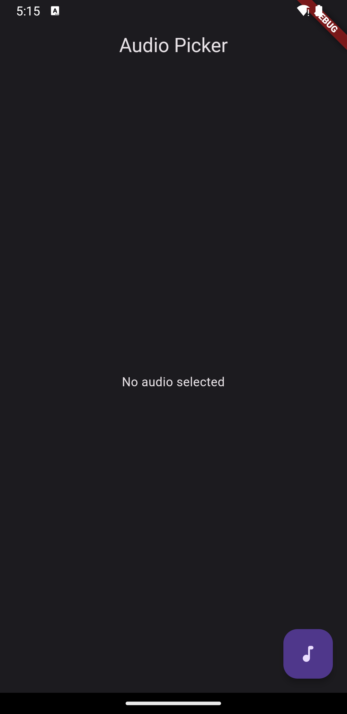
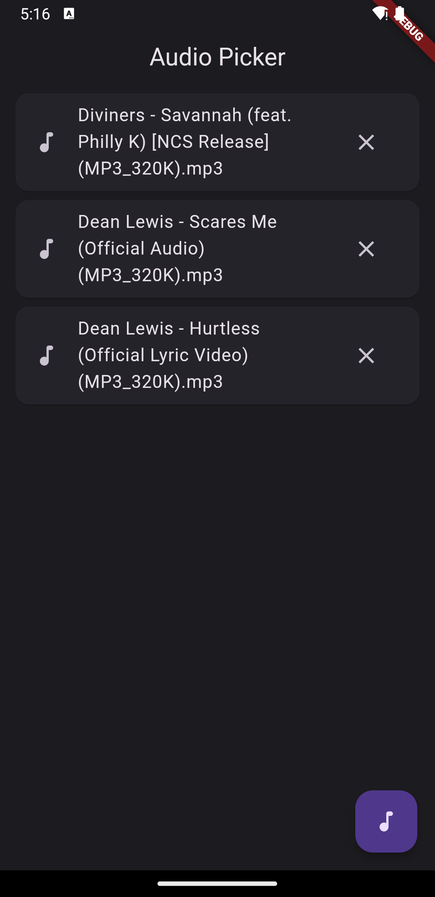
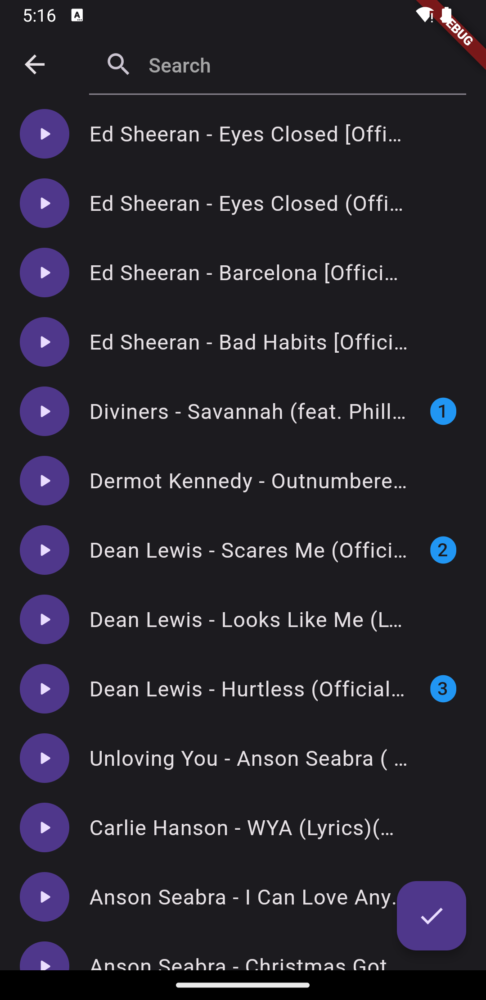
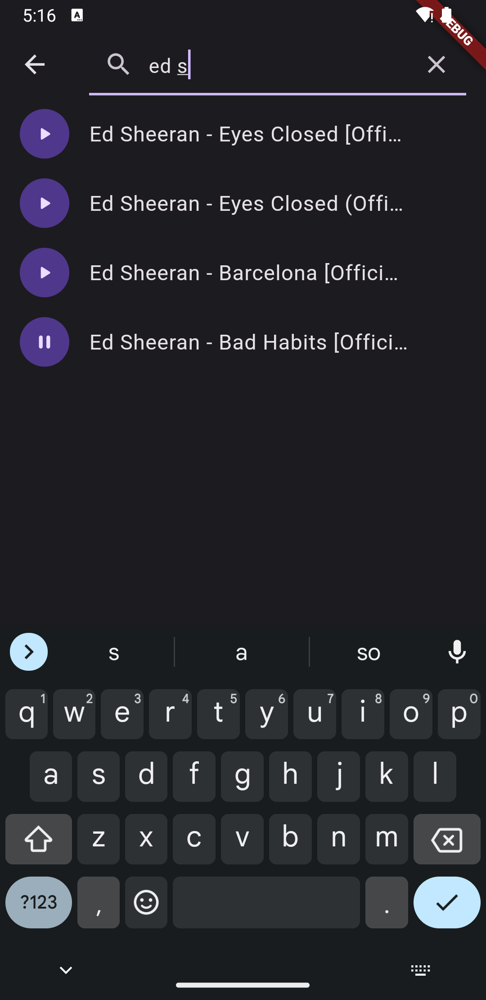

# flutter_audio_picker

Welcome to the **Flutter Audio Picker** repository! This repository contains the source code of an audio picker app build using Flutter.

## Installation

To run this App on your local machine, follow these steps:

1. Make sure you have Flutter and Dart installed. If not, you can download them from the official Flutter website.
2. Clone this repository to your local machine using the following command:

```bash
git clone https://github.com/eijiotieno-official/flutter-sentence-cutter-app.git
```

## Screenshots

### Home Page without picked audio



### Home Page with picked audio



### Selected loaded audio



### Play audio

Here Bad Habits by Ed Sheeran is playing



### Search audio

Currently searching for audio files with title Ed Sheeran, it is not case-sensitive


## Contributions

Contributions to this repository are welcome! If you have ideas for improvements, bug fixes, or additional features, feel free to submit issues and pull requests. Please make sure to follow the Flutter and Dart coding style guidelines.
